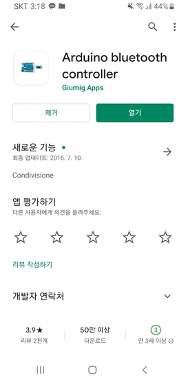

# ((((블루투스))))  
블루투스는 근거리 무선 통신을 위한 산업 표준이다. 주로 블루투스는 1대1일 통신만 지원하며 근거리 통신만 가능하다. 
이러한 블루투스의 단점을 보완하며 만들어 낸 것이 로라 통신인데 그건 다음에 사용할 기회가 있으면 교육자료를 올리겠다.
이번에 사용할 모듈 hc-06은 값싸고 가장 자주 사용하는 모델이다. 
  
　  
블루투스는 간단한 무선 통신 프로젝트를 하기 위해 가장 많이 쓰이고 자주 쓰일 것이다.
정말 간단한 데이터 수신을 위해서도 사용 된다. 블루투스가 쓰이는 곳은 정말 다양하다. 우리가 사용하는 무선이어폰,
스피커, 마우스, 키보드, 무선충전기등 정말 많은 곳에 쓰인다. 우리가 프로젝트를 진행 할 때
와이파이에 비해 덜 복잡하다는 장점과 실내에서도 서로 통신되는 장점이 있다.  
　  
우리가 무선으로 데이터를 가지고 노는 프로젝트를 할때 우리 눈에 보이지 않아 이해 안되지만 안되는 것들이 많다.
이를 이유로 우리가 꼭 프로젝트전에 [hc-06](https://www.olimex.com/Products/Components/RF/BLUETOOTH-SERIAL-HC-06/resources/hc06.pdf) 의 datasheet를 꼭 한번은 
뜯어 보는 것을 추천한다.  
　  
블루투스 센서는 Enable pin, State pin, VCC, GND, TX, RX 핀으로 총 6개로 구성 되어져있다. 하지만 여기서 Enable pin과 state pin은 쓰이지
않기 때문에 생략하겠다. VCC, GND는 다 알 것이고 TX RX가 무엇인지가 관점이다. TX는 Transmitt 즉 송신을 뜻하고 RX는
Receive로 수신을 뜻한다. 이것을 생각하고 핀 넘버링을 하여야 한다.  
　  
우리는 블루투스와 연결됬는지 확인하기 위해 가장 흔한 방법으로 AT라는 메세지를 보내게된다. 
  
그렇다면 이렇게 답장이 오는것을 확인하여 잘 작동하는지 알 수 있다. 이에 대한 예제로 밑에 사이트에 들어가면 예제들을 확인 할 수 있을 것이다.
http://www.micro4you.com/files/ElecFreaks/Bluetooth%20HC-06.pdf  
　  
우리가 블루투스를 통해 원격으로 조종할 때 가장 쉬운 방법은 무엇일까? 노트북은 무겁고 다른 장치를 쓰려면 또 새로운 것을 공부해야한다. 우리는 어플을 사용해보자  
먼저 Google play 스토어에서 'Arduino Bluetooth Controller'라는 이름을 가진 어플리케이션을 다운로드 및 설치하자  
