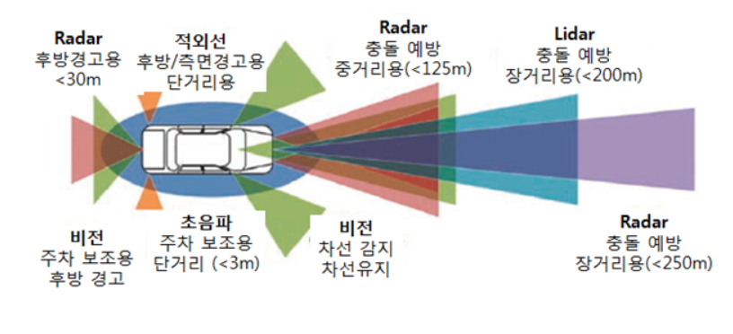
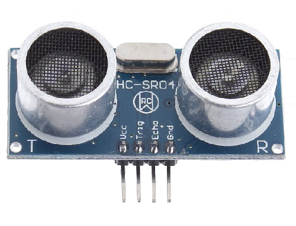
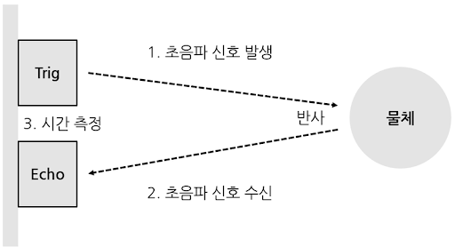
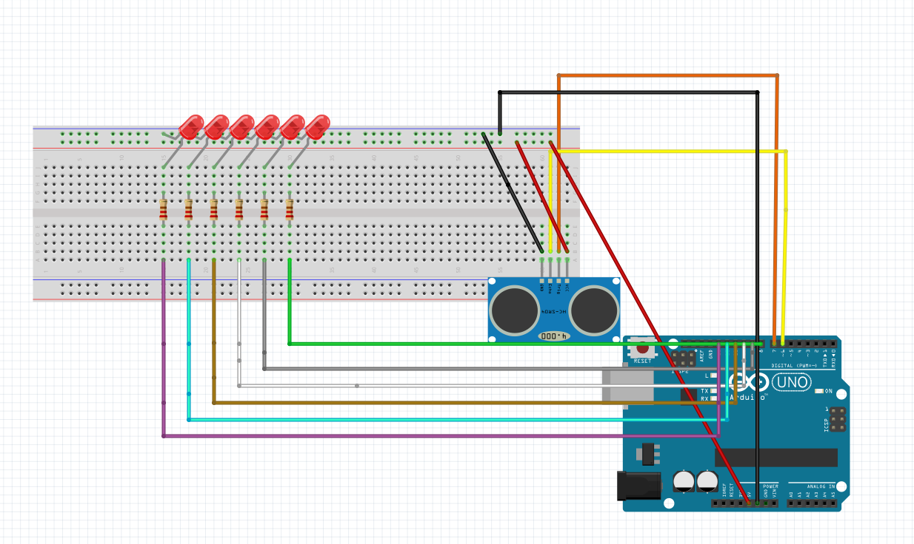

# 에너르기파(초음파센서 거리측정센서)

우리가 프로젝트를 하기 위해서는 여러가지 데이터들을 필요로한다. 그 중에서 
사물과 대상간의 거리를 구하는 것은 비접촉식 센서나 접촉식 센서로 구분 되어 있다. 
거리 측정에 사용하는 전자기파는 초음파, 마이크로웨이브, 적외선, 가시광 등을 이요한다. 
이 중에서 마이크로웨이브를 이용한 방식을 레이더(Radar), 레이저를 이용한 방식을 라이다(LiDAR)라고 한다.
거리측정용으로 사용하는 센서들의 비교 성능은 아래 표와 같다. 이러한 특성에 따ㅏ 자동차에 사용되는
거리측정용 센서들의 용도는 아래 그림과 같다.  

  
이 중 우리는 싸고 간단한 초음파 센서를 사용 하고자 한다.  
　  
　  
  

초음파 거리측정 센서는 TX와 RX가 있는데 TX를 통해 신호를 보내고 RX를 통해 신호를 받은 시간차이를 통해
거리가 얼마나 되는지 알 수 있다. 우리가 실제로 코드에 입력하는 것을 보아도 Trig에서
high신호를 보내고 echo에서 신호를 받으면 LOW가 되게 하여 거리가 얼마나 되는지 측정 할 수 있다.  
  
　  
이 센서를 사용 할때 데이터 값이 0으로 가는 것은 확인 할 수 없을 것이다.
그 이유로 하드 웨어의 한계로 알 수 있는데 
    
      digitalWrite(trigPin, HIGH); 
      delayMicroseconds(10);
      digitalWrite(trigPin, LOW);
이 코드를 보면 사이에 delayMicroseconds(10);이 들어간것을 확인 할 수 있다.
TRIG에서 신호를 보내고 ECHO에서 신호를 받아 들이는 대까지 
중간에 10mmsec 밑으로 delay가 없으면 데이터를 ECHO에서 받아 들일 수가 없다.  
실험내용
***  
사물과 센서와의 거리 측정에 따른 LED 점등  

　  
준비물
***
아누이노 우노, 브레드 보드, 점퍼선, LED, 저항, HC-SR04  
　  

